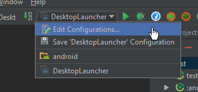
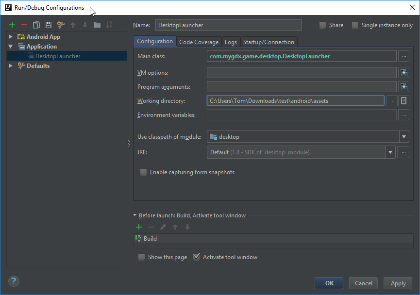
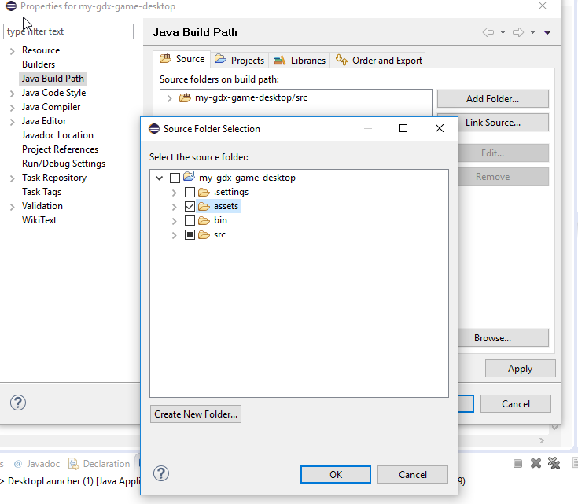
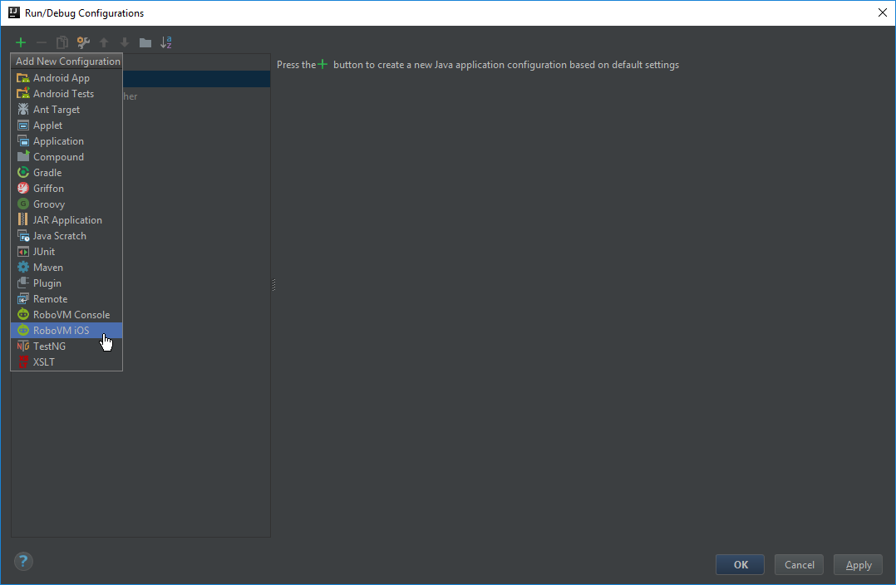

<h1> Running and Debugging a LibGDX project </h1>

You can run and debug your projects from your IDE and command line, this article will go through the recommended ways
to launch and debug your projects.

- **Running/Debugging the Desktop project**
    - [Intellij/Android studio](#running-desktop-project-in-intellij-android-studio)
    - [Eclipse](#running-desktop-project-in-eclipse)
    - [Netbeans](#running-desktop-project-in-netbeans)
- **Running/Debugging the Android project**
    - [Intellij/Android studio](#running-android-project-in-intellij-android-studio)
    - [Eclipse](#running-android-project-in-eclipse)
    - [Netbeans](#running-android-project-in-netbeans)
- **Running/Debugging the iOS RoboVM project**
    - [Intellij/Android studio](#running-ios-robovm-project-in-intellij-android-studio)
    - [Eclipse](#running-ios-robovm-project-in-eclipse)
    - ~~[Netbeans](#netbeans)~~<br>_Not supported_.    See [command line usage](#command-line-running) for alternative
- **Running/Debugging the iOS Multi-OS Engine project**
    - [Intellij/Android studio](#running-ios-multi-os-engine-project-in-intellij-android-studio)
    - ~~[Eclipse](#eclipse)~~<br>_Not supported_.    See [command line usage](#command-line-running) for alternative
    - ~~[Netbeans](#netbeans)~~<br>_Not supported_.    See [command line usage](#command-line-running) for alternative
- [Running/Debugging the HTML project](#html)

- [Running projects from command line](#command-line-running)

<br>

## Running Desktop project in Intellij/Android Studio
### Running <br><br>
- Right click your DesktopLauncher class
- Select 'Run DesktopLauncher.main()'

  _This should fail with missing assets, we need to hook up the assets folder_

- Open up Run Configurations



- Edit the Run Configuration that was just created by running the desktop project and set the working directory to point 
to your <strong>android/assets</strong> folder, or the <strong>core/assets</strong> folder if you don't have an android project



- Run your application using the run button<br><br>

### Debugging <br><br>

- Hit the Debug button instead of run after setting up the run configuration as shown above.

<br>
<hr>
<br>

## Running desktop project in Eclipse

### Running <br><br>

- Right click your desktop project > Build Path > Configure Build Path
- Click the sources tab, and click 'Add Folder'
- Select the assets folder and hit OK.



- Right click your desktop project > Run as > Java Application<br><br>

### Debugging <br><br>

- Hit the Debug button instead of run after setting up the assets folder as shown above.

<br>
<hr>
<br>

## Running desktop project in Netbeans

### Running <br><br>

- Right click the desktop project > Run

### Debugging <br><br>

- Right click the desktop project > Debug

<br>
<hr>
<br>

## Running Android project in Intellij/Android Studio

### Running <br><br>

- Right click AndroidLauncher > Run AndroidLauncher 

### Debugging <br><br>

- Right click AndroidLauncher > Debug AndroidLauncher 

<br>
<hr>
<br>

## Running Android project in Eclipse

### Running <br><br>

- Right click Android project > Run As > AndroidApplication 

### Debugging <br><br>

- Right click Android project > Debug As > AndroidApplication 

<br>
<hr>
<br>

## Running Android project in Netbeans

### Running <br><br>

- Right click Android project > Run As > AndroidApplication 

### Debugging <br><br>

- Right click Android project > Debug As > AndroidApplication 

<br>
<hr>
<br>

## Running iOS Robovm project in Intellij/Android Studio

### Running <br><br>

- Open Run/Debug Configurations
- Create a new run configuration for a RoboVM iOS application



- Select the provisioning profile and simulator/device target
- Run the created run configuration

For more information on using and configuring the RoboVM intellij plugin please see the [documentation](http://robovm.mobidevelop.com/)

<div class="well error">
<strong>NOTE:</strong> The documentation is for the 'Official' RoboVM plugin, we currently use a fork of this.

This means some of the information (such as license information) is redundant, however configuring and using the plugin should be very similar.
</div>


### Debugging <br>

<div class="well error">
Debugging is not supported at this time.
</div>

<br>
<hr>
<br>

## Running iOS Robovm project in Eclipse

### Running <br><br>

- Right click the iOS RoboVM project > Run As > RoboVM runner of your choice 


For more information on using and configuring the RoboVM eclipse plugin please see the [documentation](http://robovm.mobidevelop.com/)

<div class="well error">
<strong>NOTE:</strong> The documentation is for the 'Official' RoboVM plugin, we currently use a fork of this.

This means some of the information (such as license information) is redundant, however configuring and using the plugin should be very similar.
</div>


### Debugging <br>

<div class="well error">
Debugging is not supported at this time.
</div>

<br>
<hr>
<br>

## Running iOS Multi-OS Engine project in Intellij/Android Studio


**Please see the official documentation for a guide to running and debugging the Multi-OS Engine**
[Official Documentation](https://doc.multi-os-engine.org/multi-os-engine/3_getting_started/1_hello_world_app/hello_world_app.html#running-and-debugging-your-multi-os-engine-app)

<br>
<hr>
<br>

## HTML

Html is best suited to be run on command line you are welcome to manually setup gwt in the IDE of your choice if you are familiar with
it but the recommended way is to drop down to terminal or command prompt.

The html target can be run in [Super Dev](http://www.gwtproject.org/articles/superdevmode.html) mode, which allows you to recompile
on the fly, and debug your application in browser.

To do so, open up your favourite shell or terminal, change directory to the project directory and invoke the gradle task.

Like shown below:


_On Unix based systems_
```bash
cd C:/ProjectDirectoryPath/RootProjectDirectory

./gradlew html:superDev
```

<div class="well error">
If you get a permission denied error, set the execution flag on the gradlew file.<br>

```
chmod +x gradlew
```
</div>

_On Windows_
```bash
cd C:/ProjectDirectoryPath/RootProjectDirectory

gradlew html:superDev
```

You should see lots of text wizzing by, and if all goes well you should see the following line at the end:


You can then go to [http://localhost:8080](http://localhost:8080) (older Gradle, circa ~2.14), or [http://localhost:8080/index.html](http://localhost:8080/index.html) (newer Gradle, circa 4.6+), to see your application running, with a recompile button.

For further info on configuring and debugging with SuperDev check the documentation for [Super Dev](http://www.gwtproject.org/articles/superdevmode.html)

## Command line running

All the targets can be run and deployed to via the command line interface.

This is not only a helpful feature when debugging, but it also allows you to easily push your project to continuous integration, or use any number
of automation tools. Its also very helpful when trying to debug an issue with a build in your IDE.  It will let you know if there is a system/configuration issue
instead of perhaps an IDE issue also.

Running each of the projects if very simple, just open up your shell/terminal and enter in the following commands after **CD**ing to the root project directory.

<div class="well info">
    INFO: On unix systems, use 
    <br>```./gradlew```<br>on windows just use
    <br>```gradlew```<br> to invoke the Gradle tooling system.
</div>

### Desktop

```bash
./gradlew desktop:run
```

### Android

```bash
./gradlew android:installDebug android:run
```

### iOS RoboVM

```bash
./gradlew ios:launchIPhoneSimulator
```

__See [documentation](https://github.com/MobiDevelop/robovm/blob/master/plugins/gradle/README.md) for further configuration and other tasks__
### iOS Multi-OS Engine

```bash
./gradlew ios-moe:moeListDevices // To list devices to provide to the next task
./gradlew ios-moemoeLaunch -Pmoe.launcher.simulators=XXXXXXXXXXXX -Pmoe.launcher.options=no-build,debug:5005
```
__See [documentation](https://github.com/multi-os-engine/moe-plugin-gradle) for further configuration and other tasks__

### HTML

```bash
./gradlew html:superDev
```
