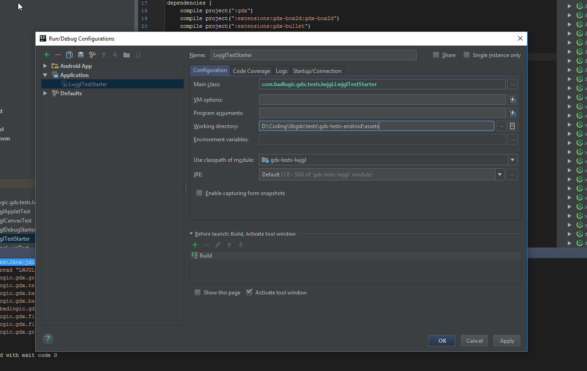

<h1>Working from source</h1>

Working with LibGDX source is relatively easy if you are comfortable with your IDE and maven/ant/gradle. Even if you aren't, this article can hopefully guide you along the way.
There are two main components when working with the LibGDX, the java source, and the native source;
Most users won't need to dive into the c/c++ components, but for those that want to this guide will also go into that.

<hr>
- **Java source only**
  - [Steps before importing](#steps-before-importing)
      - [Environment setup](#environment-setup)
      - [Obtaining the source](#obtaining-source)
      - [Fetching natives](#fetching-natives)
  - [Importing LibGDX into Intellij/Android Studio](#importing-into-intellij)
  - [Importing LibGDX into Eclipse](#importing-into-eclipse)
  - [Building LibGDX and installing](#building-libgdx)

- Building Natives
    - [Prerequisites](#prerequisites)
        - [Linux host](#linux-host)
        - [Mac Host](#mac-os-x-host)
    - [Compiling](#compiling)


<hr>
<br>

# Java source

<br>
<hr>

## Steps before importing

### Environment setup

You must have your system setup! Make sure you have gone through the [setting up](../gettingstarted/Setting Up.html) guide completely.

You will also need to install maven for installing to your local repository, and ant if you don't want to use Gradle.

### Obtaining source

To get the sources from github, you should clone the github repository.

```
git clone git://github.com/libgdx/libgdx.git
cd libgdx
```


### Fetching natives

Native binaries must be brought down in order to run. These binaries are built on the snapshot build server, so you need to run a task to bring them down.  Even if you plan on building natives later yourself,
its recommended to bring these down so you can test your development environment is setup before moving to the next step.


**From the LibGDX root directory**

_Through Gradle_
```bash
./gradlew fetchNatives
```

_Through ant_
```bash
ant -f fetch.xml
```

<div class="well error">
If you get the following error:
<br>
```java
javax.net.ssl.SSLHandshakeException
```
<br>
you need to update your JDK to at least Java 8 101.
</div>

<hr><br>

## Importing into Intellij

- File > Open > LibGDX root build.gradle
- Import all projects
- Wait for Intellij to finish syncing and indexing
- View > Tool Windows > Gradle, sync gradle button
- Make sure the Gradle sync succeeds, if not resolve the issues at hand.
- Go into preferences and turn off **configure on demand** 
- Try running the LwjglTestStart class located in **tests/gdx-tests/gdx-tests-lwjgl/src** by right clicking and running
- You should get assets not found when you try to run a test, edit the run configuration and point it to the correct assets folder.
**tests/gdx-tests-android/assets**

- 


<br>

All of the other projects are hooked up and ready to test given that you have set up your system correctly, so give them a go.

Its recommended to run the android and gwt tests on command line with the following:

ANDROID
```bash
./gradlew tests:gdx-tests-android:installDebug
```

HTML 
```bash
./gradlew tests:gdx-tests-gwt:superDev
```

<hr><br>

## Importing into Eclipse

- [Importing with Gradle](#importing-with-gradle)
- [Importing as existing project](#importing-as-existing-project)

<hr>
<br>

### Importing with Gradle


- File > Import > Gradle > Gradle project 

Its recommended to run the android and gwt tests on command line with the following:

ANDROID
```bash
./gradlew tests:gdx-tests-android:installDebug
```

HTML 
```bash
./gradlew tests:gdx-tests-gwt:superDev
```

<br>

### Importing as existing project


- File > Import > General > Existing projects into workspace
- Search for nested projects, and make sure all sub projects are discovered and checked and hit finish
- Wait for the import process and workspace refresh to fully complete.
- Solve any missing SDK problems, and run a clean in Eclipse

<br>
<hr>
<br>

## Building LibGDX

You can install LibGDX to your local maven repository by running a simple command:

```bash
mvn install
```

This will build and install LibGDX and all core components to your local maven repository with the current version 
declared in the pom.xml files 


<hr>
<br>

# Natives

<br>
<hr>
<br>

## Prerequisites
 
 Building the natives is slightly more involved. The natives are built for every platform we target:

- Desktop
    Windows, Linux and Mac both 32 and 64 bit
-  Android 
    arm6, arm7, x86, x86_64 
- iOS
    i386, arm7, arm64, x86_64

To do this we use a Linux host for crosscompilation of windows/linux and android antives. We also use a Mac host for the iOS and MacOS natives. Mac and iOS natives can only be built on MacOS.


## Linux host

What you need:

- 64 bit linux distro (we use Ubuntu 13.10)
- openjdk-7-jdk
- Ant 1.9.3+ (must be on path)
- Maven 3+ (must be on path)
- Android NDK r13b (ANDROID_NDK and NDK_HOME variables set)
- Android SDK with latest targets (ANDROID_SDK variable set)
- Compilers
    - gcc, g++, gcc-multilib, g++-multilib, (32 bit and 64 bit linux compilers)
    - mesa-common-dev, libxxf86vm-dev, libxrandr-dev, libx11-dev:i386, jglfw only
    - mingw-w64 (windows compiler 32 bit and 64 bit)
    - ccache (optional)
    - lib32z1

## Mac OS X host

What you need:

- JDK 8+
- XCode, through Mac app store
    - XCode command line utilities for latest XCode
- Ant 1.9.3+ (must be on path, use homebrew)
- ccache (optional, use homebrew)

## Compiling

Compiling the natives is handled through **Ant** scripts. 

To compile the Mac and iOS natives, run:

```bash
./ant -f build-mac-ios.xml
```

To compile the Windows, Linux and Android natives, run:

```bash
./ant -f build.xml -Dbuild-natives=true -Dversion=nightly
```

You can also run each individual platforms script to build natives for just that platform, for example just the android natives,
just run that particular script itself, (you may have to set some extra command line properties yourself, so check out each script to see what it expects).